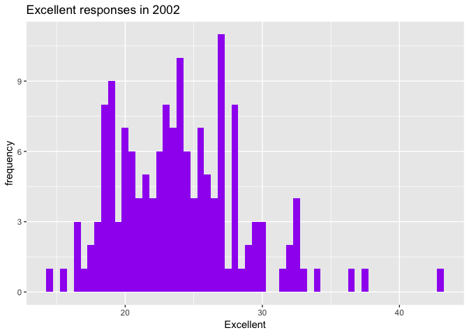
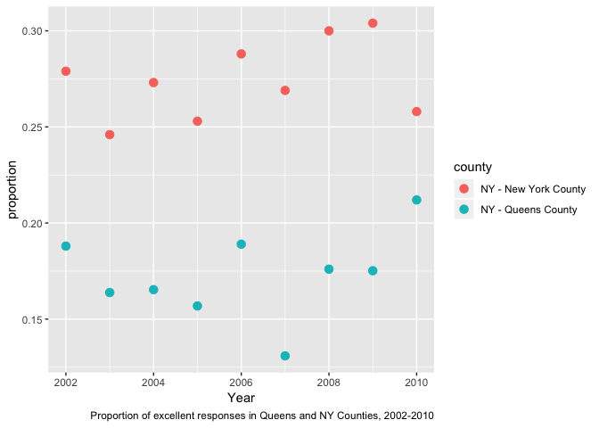

Data Science HW2
================
Nathalie Fadel
10/4/2018

Problem 1
=========

``` r
library(tidyverse)
transit_data = read_csv(file = "./data/NYC_Transit_Subway_Entrance_And_Exit_Data.csv") %>% #data import
janitor::clean_names() %>% 
select(line:entry, vending, ada) %>%  
mutate(entry = recode(entry, "YES" = TRUE, "NO" = FALSE)) 
```

These data aren't tidy as they are right now. Currently, there are 19 variables (columns) and 1868 observations (rows). I made the variable names all lowercase snake and eliminated all variables except for "line"" through "entry," "vending,"" and "ada". I also recoded the entry variable to True and False to match the way the ada variable is coded. At first it is hard to tell what the "routes" variables 1-11 say about the dataset. Then I realized that the more routes the station services, the more columns that station will have filled in. This is not a good way of organizing and expressing this data.

There are 465 distinct stations. 84 stations are ADA compliant. The proportion of stations with entry but no vending machine is 0.3770492.

``` r
transit_data_tidy = (gather(transit_data, key = route_number, value = route, route1:route11)) 
```

Here, I made a new dataframe where route number is one variable instead of 12 variables.

There are 60 stations on the A line. Of these 60, only 17 are ADA compliant.

Problem 2
=========

``` r
library(readxl)
mr_trash_wheel = read_excel(
  "./data/HealthyHarborWaterWheelTotals2018-7-28.xlsx", "Mr. Trash Wheel", range = "A2:N338") %>% 
  #import mr trash wheel datasheet from cell A2 to N258
janitor::clean_names() %>% #clean up names of variables
  filter(!is.na(dumpster)) %>% #filter out dumpster totals
  mutate(sports_balls = round(sports_balls)) %>% #round 
  mutate(sports_balls = as.integer(sports_balls)) #make it an integer
```

In this chunk, I imported the Mr. Trash Wheel datasheet from cells A2 to N258. I then cleaned the variable names, filtered out the dumpster total rows, and then mutated the sports\_balls variable to round it up to the nearest integer.

``` r
precip_data_2016 = read_excel(
  "./data/HealthyHarborWaterWheelTotals2018-7-28.xlsx", 
  "2016 Precipitation", range = "A2:B14") %>%
  janitor::clean_names() %>%
  mutate(year = 2016) #add year column
  
precip_data_2017 = read_excel(
  "./data/HealthyHarborWaterWheelTotals2018-7-28.xlsx", 
  "2017 Precipitation", range = "A2:B14") %>%
  janitor::clean_names() %>%
  filter(!is.na(total)) %>% 
  mutate(year = 2017) 

precip_stack <- rbind(
  mutate(precip_data_2016, month = month.name), 
  mutate(precip_data_2017, month = month.name)) 
```

Here, I imported the datasets, cleaned the names, added a year column, and for the 2017 precipitation dataset, I had to filter out the months with no data. I then made a new dataset with the 2016 and 2017 precipitation datasets stacked on top of each other. I also changed month number to month name.

The Mr. Trash Wheel dataset has 285 observations. The median number of sports balls in the trash in 2016 was 26.

The combined 2016 and 2017 precipitation dataset has 24 observations. It rained a total of 32.93 inches in 2017.

Problem 3
=========

``` r
brfss_data <- p8105.datasets::brfss_smart2010 %>%
  janitor::clean_names() %>%
  rename(state = locationabbr, county = locationdesc) %>%
  filter(topic == "Overall Health") %>%
  select(-(class:question), -sample_size, -(confidence_limit_low:geo_location))
```

Here, I imported and cleaned the data, filtered the topic name, and excluded the variables class through question, sample size, and lower CI through geographic location.

``` r
brfss_data <- brfss_data %>%
  spread(key = response, value = data_value) %>% 
  janitor::clean_names() %>% 
  mutate(p_excellent_vgood = (excellent + very_good) 
         / (excellent + very_good + good + fair + poor))
```

The spread function was used to make each response type its own variable. I then used the mutate function to make a variable for the proportion of excellent and very good responses.

There are 404 distinct locations in the dataset, designated by county. The dataset has 51 states, including Washington, D.C. The state with the largest number of response values is NJ, 146. The median of excellent responses in 2002 was 23.6.

Plots
-----

``` r
brfss_data %>%
  filter(year == "2002") %>%
  ggplot(aes(x = excellent)) +
  geom_histogram(binwidth = 0.5, fill = "purple") +
  labs(x = "Excellent", y = "frequency", title = "Excellent responses in 2002")
```

    ## Warning: Removed 2 rows containing non-finite values (stat_bin).



``` r
brfss_data %>%
  filter(county %in% c("NY - Queens County", "NY - New York County")) %>%
  mutate(p_excellent = excellent 
         /  (excellent + very_good + good + fair + poor)) %>% 
  ggplot(aes(x = year, y = p_excellent, color = county)) +
  geom_point(size = 3) +
  labs(x = "Year", y = "proportion", 
       caption = "Proportion of excellent responses in Queens and NY Counties, 2002-2010") 
```


